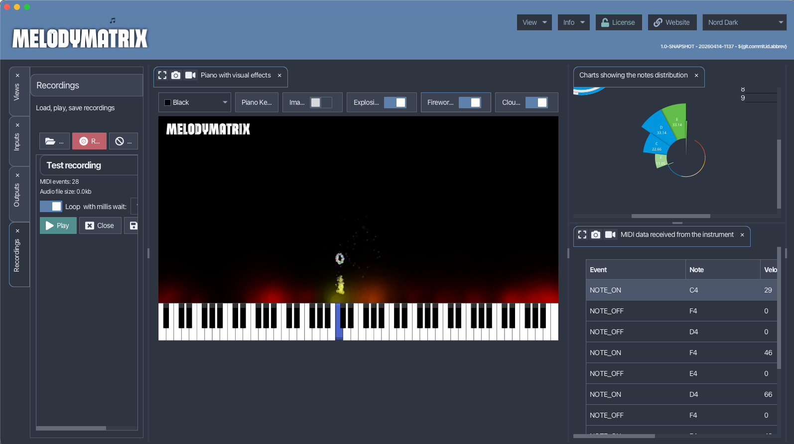
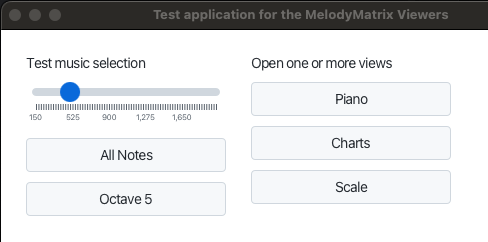
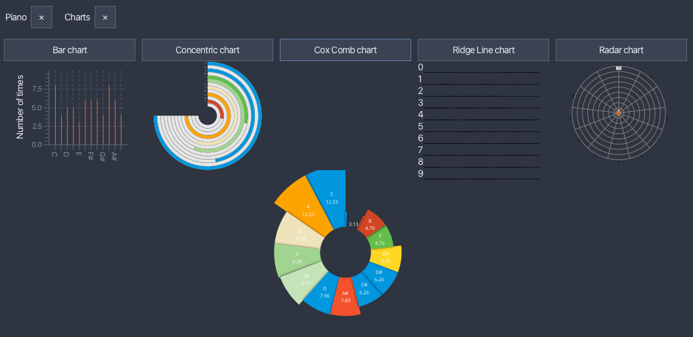

# Viewer Components of the MelodyMatrix Application

This project contains the Stage components that are used by the MelodyMatrix application to visualize music. It's a
JavaFX/Kotlin/Gradle project as that is also what is used for the MelodyMatrix application itself.



What this project contains:

* Views
* Simple simulator to send MidiData

What this project doesn't contain:

* MIDI communication
* Loading, saving and storing recordings
* All the other tools (to be) included in MelodyMatrix

## Requirements

* JDK 21 or newer
* Gradle

## Guidelines

### How to run the viewers test application

* Clone the repository
* Open the cloned directory in IntelliJIDEA
* Import as Gradle project
* Open `be.codewriter.melodymatrix.view.TestLauncher`
* Hit 'Run' on the 'main' method

### Testing a viewer

* Once the application has started, selected one of the included music patterns
  
* You can adjust the speed to speed up or slow down the notes
* Select one or more of the views to see the effect
  

### Add an extra view

* Create a directory in 'stage' for the new view
* Add a class in that new directory `YourViewStage.kt`
* Make sure it implements `VisualizerStage()`
* Look at one of the existing views how to add components
* The handling of the notes that are played, needs to be implemented in an override:

```java
override fun onMidiDataReceived(midiData:MidiData) {
    val note = midiData.note
    // Add your logic here
}
```

* Add a button to open the new view in `test.TestViewButtons.kt`
* Run the application and test your new view
