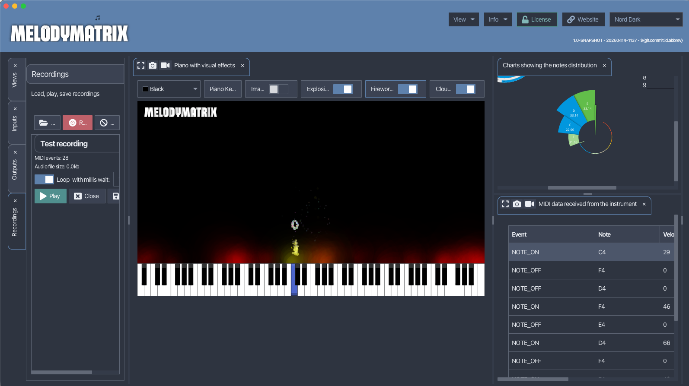
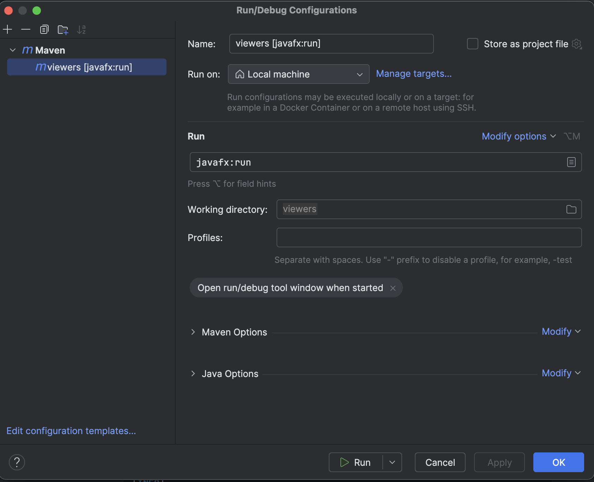
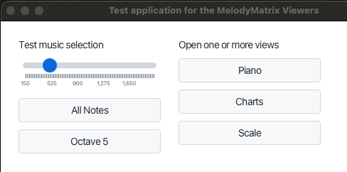
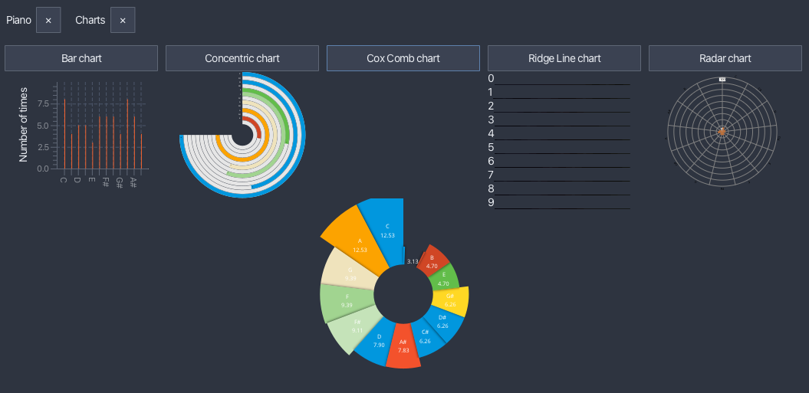

# Viewer Components of the MelodyMatrix Application

This project contains the Stage components that are used by the MelodyMatrix application to visualize music. It's a
JavaFX/Kotlin/Maven project as that is also what is used for the MelodyMatrix application itself. More information and a
video are available on [https://melodymatrix.rocks/sources](https://melodymatrix.rocks/sources).



What this project contains:

* Views
* Simple simulator to send MidiData

What this project doesn't contain:

* MIDI communication
* Loading, saving and storing recordings
* All the other tools (to be) included in MelodyMatrix

## Requirements

* JDK 26 or newer
* Maven

## Guidelines

### How to run the viewers test application

* Clone the repository
* Open the cloned directory in IntelliJIDEA
* Import as Maven project
* In your IDE create a run configuration for `javafx:run`



### Testing a viewer

* Once the application has started, select one of the included music patterns
  
* You can adjust the speed of the "played" notes
* Select one or more of the views to see the effect
  

### Add an extra view

* Create a directory in 'stage' for the new view
* Add a class in that new directory `YourView.kt`
* Make sure it implements `MmxView()`
* Look at one of the existing views how to add components
* The handling of the notes that are played, needs to be implemented in an override:

```java
override fun

onEvent(event:MmxEvent) {
    when(event.type) {
        MmxEventType.MIDI ->{
            val midiDataEvent = event as ? MidiDataEvent ? : return
            // Do something with the midi event
        }

        MmxEventType.PLAY ->{
            // And/or use the play event
        }

        MmxEventType.CHORD ->{
            // And/or use the chord event
        }
    }
}
```

* Add a button to open the new view in `test.TestView.stageOptions`
* Run the application and test your new view

## Run with Maven

Default step-by-step to run this project on a Linux / Raspberry Pi system:

```shell
# Install SDKMAN 
$ curl -s "https://get.sdkman.io" | bash

# Open new terminal or 
$ source "$HOME/.sdkman/bin/sdkman-init.sh"

# Instal JDK with JFX 
$ sdk install java 26.0.0.fx-zulu
# When needed, set as default
$ sdk default java 26.0.0.fx-zulu

# Install Maven
$ sdk install maven

# Check versions
$ mvn -version
$ java -version

# Get the sources
$ git clone https://github.com/codewriterbv/melodymatrix-app-views.git
$ cd melodymatrix-app-views

# Start as JavaFX application
$ mvn javafx:run

# Build without compiling and running the tests
$ mvn package -Dmaven.test.skip=true
```