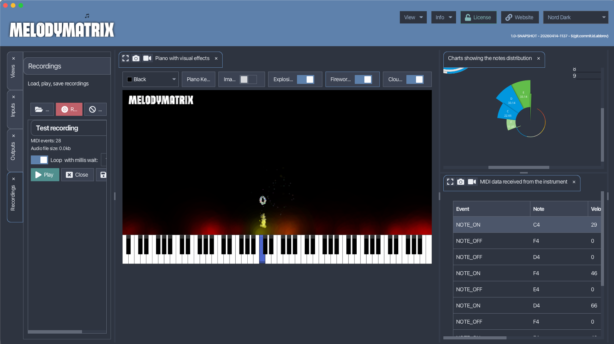
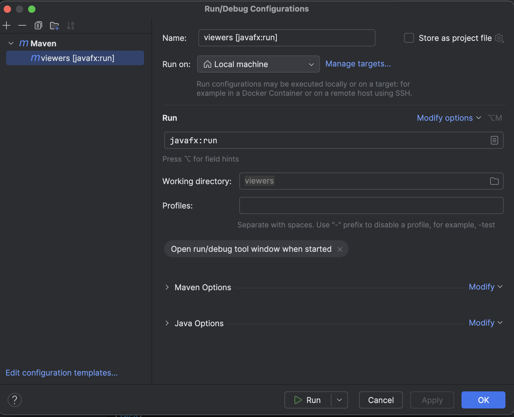
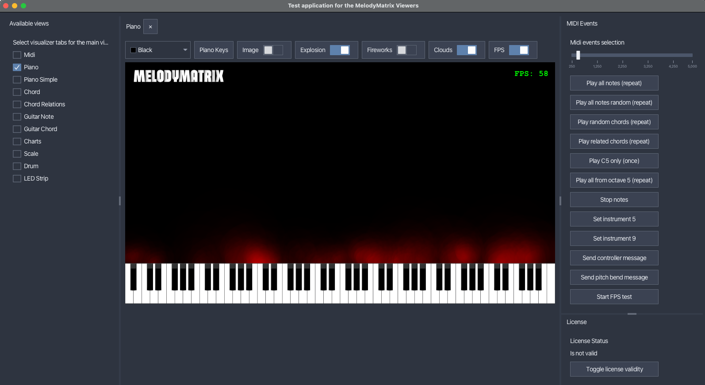
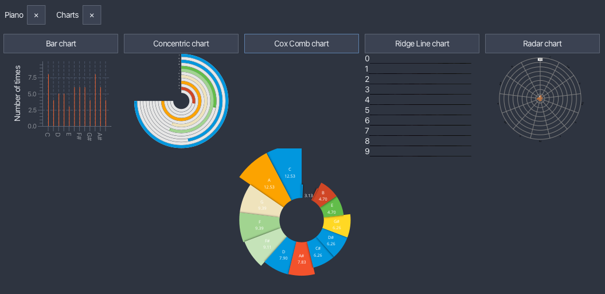

# Viewer Components of the MelodyMatrix Application

This project contains the Stage components that are used by the MelodyMatrix application to visualize music. It's a
JavaFX/Kotlin/Maven project as that is also what is used for the MelodyMatrix application itself. More information and a
video are available on [https://melodymatrix.rocks/sources](https://melodymatrix.rocks/sources).



What this project contains:

* Views
* Simple simulator to send MidiData

What this project doesn't contain:

* MIDI communication
* Loading, saving and storing recordings
* All the other tools (to be) included in MelodyMatrix

## Requirements

* JDK 27 or newer
* Maven

## Project structure

This repository is a small multi-module Maven build that needs nothing else from MelodyMatrix:

| Module | Artifact | Contents |
|---|---|---|
| `model/` | `viewers-model` | Notes, chords, chord detection rules and the events the views receive (`MmxEvent`, `MidiDataEvent`, `PlayEvent`, `ChordEvent`, ...). Plain Kotlin, no JavaFX. |
| `views/` | `viewers` | The JavaFX views (piano, guitar, drum, staff, sheet music, chord views, charts, LED strip, ...) and the i18n runtime. |
| `demo/` | `viewers-demo` | A test application that feeds the views with simulated MIDI and audio. |

The MelodyMatrix application uses `viewers-model` in its engine and `viewers` in its user interface.

## Guidelines

### How to run the viewers test application

* Clone the repository
* Open the cloned directory in IntelliJIDEA
* Import as Maven project
* In your IDE create a Maven run configuration for `javafx:run` in the root directory; it builds
  `model` and `views` and starts the demo application (`demo/.../TestLauncher.kt`)



### Testing a viewer

* Once the application has started, select one of the included test events in the right column
  
* You can adjust the speed of the "played" notes
* Select one or more of the views to see the effect, for example the charts:
  

### Add an extra view

* Create a new directory in `views/src/main/kotlin/be/codewriter/melodymatrix/view/view`
* Add a class in that new directory `YourView.kt`
* Make sure it implements `MmxView()`
* Look at one of the existing views how to add components
* The handling of the notes that are played, needs to be implemented in an override:

```java
override fun

onEvent(event:MmxEvent) {
    when(event.type) {
        MmxEventType.MIDI ->{
            val midiDataEvent = event as ? MidiDataEvent ? : return
            // Do something with the midi event
        }

        MmxEventType.PLAY ->{
            // And/or use the play event
        }

        MmxEventType.CHORD ->{
            // And/or use the chord event
        }
    }
}
```

* Add a button to open the new view in `stageOptions` of `demo/.../view/demo/TestView.kt`
* Run the application and test your new view

## Run with Maven

Default step-by-step to run this project on a Linux / Raspberry Pi system:

```shell
# Install SDKMAN 
$ curl -s "https://get.sdkman.io" | bash

# Open new terminal or 
$ source "$HOME/.sdkman/bin/sdkman-init.sh"

# Instal JDK with JFX 
$ sdk install java 27.0.0.fx-zulu
# When needed, set as default
$ sdk default java 27.0.0.fx-zulu

# Install Maven
$ sdk install maven

# Check versions
$ mvn -version
$ java -version

# Get the sources
$ git clone https://github.com/codewriterbv/melodymatrix-app-views.git
$ cd melodymatrix-app-views

# Start the demo application (builds model and views first)
$ mvn javafx:run

# Run all tests
$ mvn test

# Build without compiling and running the tests
$ mvn package -Dmaven.test.skip=true
```