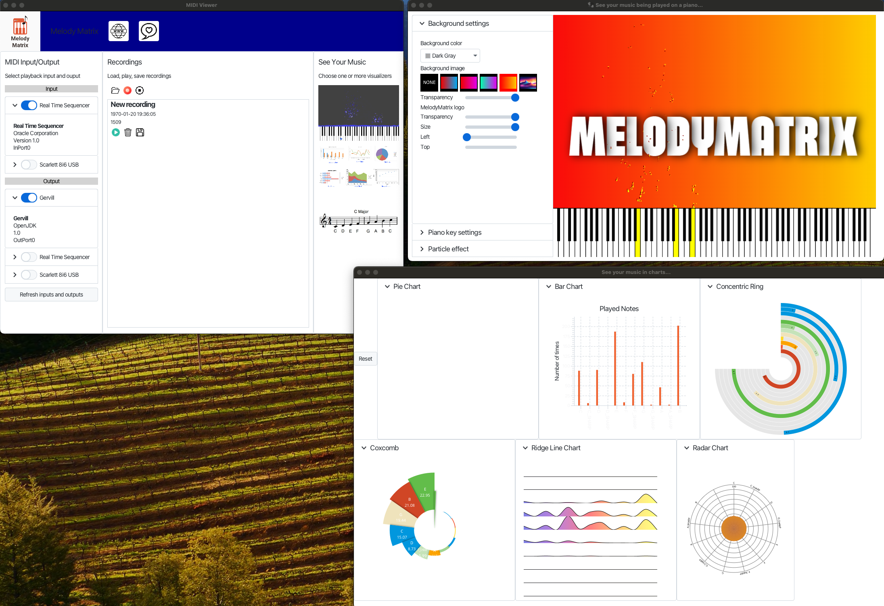
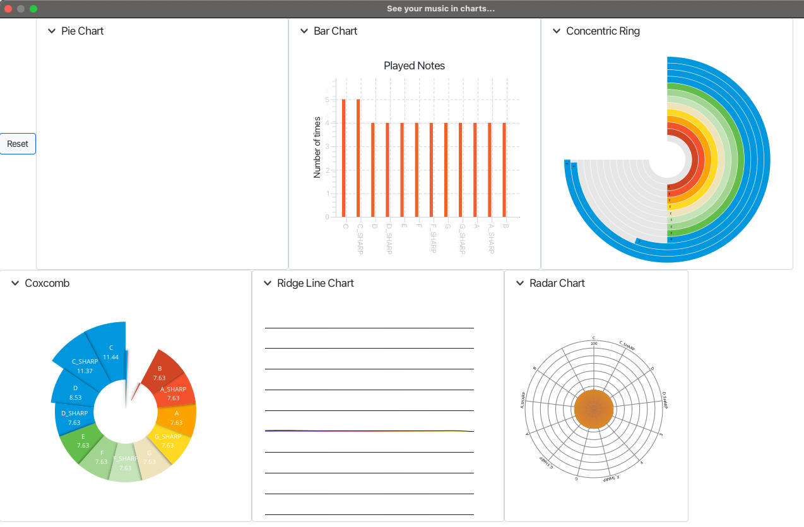

# Viewer Components of the MelodyMatrix Application

This project contains the Stage components that are used by the MelodyMatrix application to visualize music. It's a
JavaFX/Kotlin/Gradle project as that is also what is used for the MelodyMatrix application itself. More information and
a video are available on [https://melodymatrix.rocks/sources](https://melodymatrix.rocks/sources).



What this project contains:

* Views
* Simple simulator to send MidiData

What this project doesn't contain:

* MIDI communication
* Loading, saving and storing recordings
* All the other tools (to be) included in MelodyMatrix

## Requirements

* JDK 21 or newer
* Gradle or Maven

## Guidelines

### How to run the viewers test application

* Clone the repository
* Open the cloned directory in IntelliJIDEA
* Import as Gradle or Maven project (both configurations are included)
* Open `be.codewriter.melodymatrix.view.TestJavaLauncher`
* Hit 'Run' on the 'main' method

### Testing a viewer

* Once the application has started, select one of the included music patterns
  
* You can adjust the speed of the "played" notes
* Select one or more of the views to see the effect
  

### Add an extra view

* Create a directory in 'stage' for the new view
* Add a class in that new directory `YourViewStage.kt`
* Make sure it implements `VisualizerStage()`
* Look at one of the existing views how to add components
* The handling of the notes that are played, needs to be implemented in an override:

```java
override fun onMidiDataReceived(midiData:MidiData) {
    val note = midiData.note
    // Add your logic here
}
```

* Add a button to open the new view in `test.TestViewButtons.kt`
* Run the application and test your new view

## Run with Maven

To make it easier to run and extend this project, it also includes a Maven configuration, which can be used on e.g.
Raspberry Pi:

```shell
# Install SDKMAN 
$ curl -s "https://get.sdkman.io" | bash

# Open new terminal or 
$ source "$HOME/.sdkman/bin/sdkman-init.sh"

# Instal JDK with JFX and set as default
$ sdk install java 22.0.1.fx-zulu
$ sdk default java 22.0.1.fx-zulu

# Install Maven
$ sdk install maven

# Check versions
$ mvn -version
Apache Maven 3.9.7 (8b094c9513efc1b9ce2d952b3b9c8eaedaf8cbf0)
Maven home: /home/frank/.sdkman/candidates/maven/current
Java version: 22.0.1, vendor: Azul Systems, Inc., runtime: /home/frank/.sdkman/candidates/java/22.0.1.fx-zulu
Default locale: en_GB, platform encoding: UTF-8
OS name: "linux", version: "6.6.31+rpt-rpi-2712", arch: "aarch64", family: "unix"

$ java -version
openjdk version "22.0.1" 2024-04-16
OpenJDK Runtime Environment Zulu22.30+13-CA (build 22.0.1+8)
OpenJDK 64-Bit Server VM Zulu22.30+13-CA (build 22.0.1+8, mixed mode, sharing)

# Get the sources
$ git clone https://github.com/codewriterbv/melodymatrix-app-views.git
$ cd melodymatrix-app-views

# Start as JavaFX application
$ mvn javafx:run

# Build without compiling and running the tests
$ mvn package -Dmaven.test.skip=true

```
